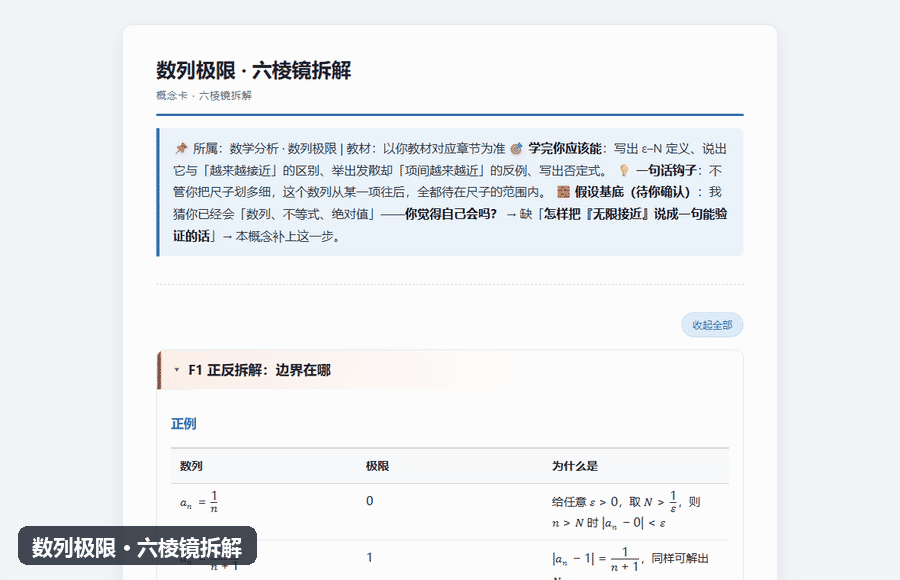

# 大学数学概念拆解教练（math-concept-coach）

> 大一新生把大学数学当高中题来刷，越刷越慌——**他们缺的不是题型，是把定义真正读懂的能力**。
> 这个技能把一个概念按「六棱镜」拆成六个面讲透，并交付一张**能拖、能打印、断网也能用**的离线概念卡。


-blue)




**🌐 在线预览（免安装，点开即玩）**：<https://zhjx19.github.io/math-concept-coach/>
—— 直接点开三张真实概念卡，拖滑块看「一致连续 / 数列极限 / 矩阵的秩」。

[在线预览](#它会交付什么) · [快速开始](#快速开始) · [触发方式](#触发方式) · [它和同类有什么不同](#它和同类有什么不同) · [安全边界](#安全边界)

**一行安装**

```bash
npx skills add zhjx19/math-concept-coach
```

> 不想用命令行？把 `math-concept-coach/` 整个文件夹放进你所用客户端的技能目录也行，
> 见下方[「安装（三步）」](#安装三步)。

---

## 你什么时候需要它？

1. **「极限我背下来了，但一做题还是不会」** —— 会背定义 ≠ 理解定义。技能用**删条件实验**逼出"为什么这个字不能改"。
2. **「连续和一致连续到底差在哪」** —— 两个概念只差一个量词顺序。技能用**对比 + 可拖动的图**把那一条差别放大给你看。
3. **「学完一章，不知道它和前后有什么关系」** —— 技能给出**知识图谱**：它站在哪一层，前面靠谁，后面通向谁。

> 面向**大学数学**（数学分析、高等代数、解析几何、概率统计、常微分方程、复变函数、抽象代数）。
> 不适合 K12，也不代写作业与论文。

---

## 它会交付什么？

**不是一段讲解文字，是一张可复用的离线卡片。** 先看真实产物：
🌐 **在线画廊** <https://zhjx19.github.io/math-concept-coach/>（点开即玩，无需安装）；也可本地打开 [`examples/index.html`](examples/index.html)。里面是 3 张**真实生成**的卡片：

| 卡片 | 课程 | 交互图形 | 你能拖什么 |
|---|---|---|---|
| [一致连续](https://zhjx19.github.io/math-concept-coach/一致连续-概念卡.html) | 数学分析 | 函数图像 + ε 带 | 固定 δ 只移动位置，看哪里冲出 ε 带 |
| [数列极限](https://zhjx19.github.io/math-concept-coach/数列极限-概念卡.html) | 数学分析 | 数列 ε–N | 拖 ε，看 N 怎么变、带外的红点何时消失 |
| [矩阵的秩](https://zhjx19.github.io/math-concept-coach/矩阵的秩-概念卡.html) | 高等代数 | 线性变换 | 拖矩阵元素，看单位正方形何时被压扁、秩从 2 掉到 1 |

每张卡片都包含：

- ✅ **网页内可拖动的交互图形**（自绘 Canvas，零依赖，不装 GeoGebra 也能用）
- ✅ **可复制到 GeoGebra 的复现指令**（想用软件自己玩也行）
- ✅ **知识图谱**（前置 / 后续 / 对偶概念）
- ✅ **公式**（MathML，离线渲染）
- ✅ **自检小题 + 折叠答案**、常见错位清单（**标注误区来源**）、**一道「换你拆一个新概念」迁移题**
- ✅ **「两头往中间」求解程序**：概念懂了、题还是不会做？给一套**从定义出发**的通用开局——不背套路
- ✅ **理解度判据 + 条件反射清单**：「说到这个概念你要想到……」闭卷能一口气说出 ≥4 条才算过
- ✅ **反例构造六法**：想不出反例时，按手法造（推边界 / 造振荡 / 换定义域 / 取退化值 / 造子列 / 造「坏点对」）
- ✅ **渐进揭示**：六个面默认只展开 F1，其余点开看（右上角一键展开）；**打印时自动全部展开**
- ✅ **⚠️ 核对提示**：凡讲法与教材口径不同的地方都**显式标注**（`〔教材口径〕` / `〔待核〕`），并在文末集中列出——
  存疑结论**不会静默写进卡片**（`check_card.py` 强制检查，有〔待核〕无核对提示直接报错）
- ✅ **单文件、0 外部依赖、可打印**（约 60–90 KB）

> 断网、没装任何软件、双击就能打开；打印时自动隐去滑块与折叠按钮、展开全部内容，只留图形与文字。

---

## 快速开始

### 安装（三步）

**方式 A：一行安装（推荐）**

```bash
npx skills add zhjx19/math-concept-coach
```

**方式 B：手动三步**

1. 得到 `math-concept-coach` 文件夹（`git clone` 下来，或从 Releases 下载 zip）；
2. 把**整个文件夹**复制到技能目录：

   | 系统 | 路径 |
   |---|---|
   | Windows | `C:\Users\<你的用户名>\.workbuddy\skills\` |
   | macOS / Linux | `~/.workbuddy/skills/` |

3. **重启客户端**（或刷新技能列表），技能才会被扫描到。

其他 runtime：同一文件夹也可放到 `~/.config/opencode/skills/`（OpenCode）或项目级 `.claude/skills/`，跨平台无需改文件。

**为什么它是通用的**

| 维度 | 做法 |
|---|---|
| 格式 | 标准 `SKILL.md` + YAML frontmatter，不依赖任何客户端专有字段 |
| 依赖 | 只用 Python 标准库；不联网、不要 API key、不要 GeoGebra、不要 Node |
| 公式 | 内置 LaTeX → MathML 转换器；pandoc 有则用、无则降级，功能不受影响 |
| 路径 | 脚本用 `__file__` 定位自身资源，**与当前工作目录无关**；命令行调用时先 `cd` 到技能目录，或用绝对路径 |
| Python | 优先 `python3`（macOS / Linux 一般只有 `python3`；Windows 上通常写作 `python`） |

### ⚠️ 头号安装失败原因：多套了一层目录

```
✅ .workbuddy/skills/math-concept-coach/SKILL.md
❌ .workbuddy/skills/math-concept-coach/math-concept-coach/SKILL.md
```

只要 `SKILL.md` 不在技能文件夹的**第一层**，客户端就找不到它。

---

## 环境依赖

| 依赖 | 必需？ | 说明 |
|---|---|---|
| **Python 3** | ✅ 必需 | 仅用**标准库**，无需 `pip install` |
| **pandoc** | ⬜ 推荐 | 用于把公式渲染成 MathML。**没装也能出卡**——见下方降级模式 |
| Node.js | ⬜ 可选 | 仅在**改动交互组件后**跑回归测试时需要（该脚本未打进分发包） |
| GeoGebra | ⬜ 可选 | 学生想在软件里复现指令才需要 |

### 没有 pandoc 会怎样？

**照样出卡。** 技能内置了一个纯标准库的转换器：

- 交互图形、知识图谱、GeoGebra 指令**完全正常**；
- 公式改用内置的 LaTeX → MathML 转换器，覆盖大学数学常用语法
  （上/下标、分式、根式、希腊字母、求和积分极限、关系运算符等）；
- 个别超出能力的复杂公式会**原样显示 LaTeX 源码**（绝不猜测，公式出错比公式难看严重）。

实测：样例卡《数列极限》共 120 处公式，降级模式下 **117 处成功渲染为 MathML**，仅 3 处回落源码。

想装 pandoc：<https://pandoc.org/installing.html>；已装但不在 PATH，可设环境变量 `PANDOC` 指向可执行文件。

### 验证装好了

在**任意目录**执行（脚本会自动定位自己的资源文件）：

```bash
python3 "<技能目录>/scripts/md2card.py" "examples/数列极限-概念卡.md"
```

能输出 `交互组件 1 个 | 知识图谱 1 张 | 公式(MathML) N 处` 并生成 `.html`，即安装成功。

---

## 触发方式

装好后直接用自然语言提问：

- 「怎么理解一致连续？」
- 「连续和一致连续到底有什么区别？」
- 「矩阵的秩的几何意义是什么？」
- 「为什么要这样定义数域？这个条件能不能去掉？」
- 「线性相关和线性无关怎么区分？」
- 「数列极限的 ε–N 到底在说什么？」
- 「定积分的定义为什么要用黎曼和？」
- 「这个概念和我前面学的 XX 有什么关系？」

技能会**先问你 1–2 个问题让你自己动手想**，再给完整拆解，最后生成 `.html` 概念卡。

---

## 示例

**输入**：「怎么理解矩阵的秩？」

**过程**：先出一道动手题（"下面两个矩阵，哪个信息量更少？"）→ 等你回答 → 六棱镜拆解 → 生成卡片。

**输出片段**（卡片内的 F0 与 F5）：

> 🎯 **一句话钩子**：这个变换把空间压扁到了几维——压不扁就是满秩，压成一条线就是秩 1。
> 🧱 **假设基底（待你确认）**：我猜你已经会「矩阵、行列式、消元法」——**你觉得自己会吗？** → 缺「怎样刻画真正有效的信息量」→ 本概念补上这一步。
>
> **F5**：（可拖动的 2×2 线性变换图）「把 a 和 c 都拖到 0，看单位正方形何时被压成线段、秩从 2 掉到 1。」

完整产物见 [在线概念卡](https://zhjx19.github.io/math-concept-coach/矩阵的秩-概念卡.html)（或本地 `examples/矩阵的秩-概念卡.html`）。

---

## 它和同类有什么不同？

| | 本技能 | 通用「解释这个概念」的提示词 | 数学可视化工具集 | 数学家教/解题类 Skill |
|---|---|---|---|---|
| 输出 | **可复用的离线 HTML 卡片** | 一段对话文字 | 一堆独立可视化页面 | 解题过程 |
| 是否强制覆盖六个面 | ✅ 少一面要写明理由 | ❌ 看临场发挥 | ❌ 只有图形 | ❌ |
| 是否先让学生动手 | ✅ 先出 1–2 道动手题 | ❌ 直接给答案 | 部分 | ❌ |
| 是否给「怎么用」的程序 | ✅ **两头往中间**（从定义出发的通用开局） | ❌ | ❌ | 部分（但多为套路/题型） |
| 交互图形 | ✅ 自动生成、可拖动 | ❌ | ✅ 但需人工挑选 | ❌ |
| 知识图谱（前置/后续） | ✅ | ❌ | ❌ | ❌ |
| 离线 / 零依赖 | ✅ 单文件 | — | 多数需要联网或服务器 | — |
| 面向 | **大学数学（中文）** | 通用 | 多为 K12 | 多为 K12 或竞赛 |

参考过的同行（学手艺，不偷皮）：
[math-concept-film](https://github.com/liangdabiao/math-concept-film)（六幕框架与「一句话钩子」）、
[math-viz-kit](https://github.com/edu-ai-builders/math-viz-kit)（设计三问与认知动作）、
[smart-learn](https://github.com/HYH926/smart-learn)（方法论命名）、
[Mathigon/textbooks](https://github.com/mathigon/textbooks)（交互式教材）。

---

## 安全边界

- **只读 + 只新增**：技能只读取 `references/`，只**新建**概念卡的 `.md` / `.html`。**不会删除、覆盖或移动你的任何既有文件**。
- **不联网**：生成的卡片 0 外部依赖，脚本不发任何网络请求。
- **不代写**：不做作业、不写论文；只给方法、引导与自检题。
- **不编造**：定义、定理、符号没把握时，明确标注「请核对教材第 X 节」。卡片里的**反例尤其严格**——没把握的反例会改成"请你试着构造一个"。
- **会停下来问你**：讲解前先出 1–2 道动手题并**等你回答**；你说"我不会 / 直接讲"，会先给一个**完整示范**让你分析，再退回让你自己做一步，而不是直接甩定义给你。
- **隐私**：不含任何 API key、token、私人路径。脚本按环境变量与常见安装位置**逐盘探测** pandoc，代码里没有写死任何具体机器的路径。

---

## 文件结构

```
math-concept-coach/
├── SKILL.md                       技能主文件（工作流、纪律红线、自检清单）
├── README.md                      本文件
├── CHANGELOG.md                   更新日志（每个版本"为什么改"）
├── LICENSE                        MIT
├── .claude-plugin/
│   └── marketplace.json           Claude Code 插件市场清单（双通道）
├── references/
│   ├── philosophy.md              理念底座（六重错位、知识大厦、三位一体）
│   ├── process-playbook.md        过程手册：求解程序 / 理解度判据 / 反例构造 / 误区诊断
│   ├── source-integrity.md        来源与存疑规范：三类标记、存疑六类、「核对提示」写法
│   ├── six-facets-guide.md        六棱镜逐面操作手册（含 F0 钩子与假设基底）+ 完整范例
│   ├── rigorous-language.md       量词顺序、否定式、表述陷阱、符号规范
│   ├── visualization-guide.md     设计三问、认知动作→组件映射、不画的情形
│   └── widget-spec.md             交互组件 / 知识图谱 / GeoGebra 指令的参数规范
├── scripts/
│   ├── md2card.py                 Markdown → 单文件离线可交互 HTML
│   ├── check_card.py              概念卡质检（格式 + 存疑标注）+ 举证清单（交付前逐条验算）
│   ├── knowledge_map.py           知识图谱 SVG 生成（可单独自测）
│   ├── texmath.py                 降级用的 LaTeX → MathML 转换器（可单独自测）
│   ├── make_gallery.py            扫描 examples/ 重建画廊首页
│   ├── make_demo_gif.py           用 Chromium 真实渲染生成 assets/demo.gif
│   └── (smoke_test_widgets.mjs)   交互组件回归测试 —— 仅开发用，未打进分发包
├── assets/
│   ├── card-widgets.js            交互组件库（plot / seq / riemann / matrix2 / vectors2）
│   ├── concept-card.css           概念卡样式（浅色、可打印、窄屏适配）
│   ├── demo.gif                   README 首图演示（浏览器真实渲染回放）
│   └── demo.tape                  vhs 录制脚本（终端流水线那一段）
└── examples/
    ├── index.html                 画廊首页（可点开看真实产物）
    ├── 核心概念清单.md            按课程列出的大学数学核心概念
    ├── 一致连续-概念卡.md/.html   样例：数学分析 · plot 组件
    ├── 数列极限-概念卡.md/.html   样例：数学分析 · seq 组件
    └── 矩阵的秩-概念卡.md/.html   样例：高等代数 · matrix2 组件
```

---

## 验证与测试

```bash
# 1. 组件回归（改过 assets/card-widgets.js 后必跑；需 Node）
node scripts/smoke_test_widgets.mjs

# 2. 公式转换器自测
python3 scripts/texmath.py

# 3. 知识图谱自测
python3 scripts/knowledge_map.py

# 4. 生成卡片 + 质检（质检会输出「举证清单」，交付前逐条验算）
python3 scripts/md2card.py "examples/数列极限-概念卡.md"
python3 scripts/check_card.py "examples/数列极限-概念卡.md"

# 5. 重建画廊
python3 scripts/make_gallery.py
```

**测试 prompt**（给技能本身的回归用例，期望输出见括号内）：

| 输入 | 期望 |
|---|---|
| 「怎么理解一致连续？」 | 先出 1–2 道动手题；六面齐全；含 `plot` 组件 + 知识图谱；生成卡片 |
| 「连续和一致连续的区别？」 | 走**对比**认知动作；明确指出差别在「δ 能否共用」 |
| 「矩阵的秩是什么？」 | F3 含删条件实验 + 操作骨架；指出「行秩=列秩」是定理不是定义；生成卡片 |
| 「我不会，直接讲」 | 先给一个**完整示范**（换个简单概念拆一遍）→ 让他分析 → 再退回原概念让他自己做一步 |
| 任何拆解收尾 | 有一句**「学完后能……」**的可观测目标；自检里含 1 道**创造层**题 + 1 道**迁移题** |
| 出卡交付前 | 跑 `check_card.py` → 按**「举证清单」逐条验算**（奇偶 / 取值 / 反例不得说反）；算不出的改成"请你构造" |

---

## 常见问题

**Q：提示「未找到 pandoc」？**
不会阻塞——会走内置转换器出卡（见「没有 pandoc 会怎样」）。想获得更完整的公式排版，装 pandoc 或设 `PANDOC` 环境变量。

**Q：卡片里的公式显示成一堆 `$...$`？**
说明公式既没被 pandoc 渲染、也没被内置转换器解析（例如用了矩阵环境）。检查输出里 `公式(MathML)` 的计数；仍不行就把该公式改写成更基础的语法。

**Q：表格排版错乱？**
Markdown 表格单元格里的 `|x|` 会被当成列分隔符。一律写成 `\lvert x \rvert`。`check_card.py` 会检查这一项。

**Q：怎么保证卡片里的数学不出错？**
`check_card.py` 是**格式**检查，它**查不出数学笔误**。为此它会在末尾列出**「举证清单」**——把卡片里所有反例、边界例、删条件后果、奇偶性/数量断言、具体取值都抽出来。**出卡前必须逐条重新验算**（例如 $a_n=(-1)^n$ 到底是奇数项还是偶数项贴近某个值）。这套纪律写进了 `SKILL.md` 第 4 步的「事实复核闸门」与 `references/rigorous-language.md` 的「举证纪律」。

**Q：卡片需要联网吗？**
不需要。CSS / JS / 公式（MathML）/ 图形（SVG + Canvas）全部内联。

**Q：交互图形拖不动？**
用现代浏览器（Chrome / Edge / Firefox / Safari）打开；不要用 Word、WPS 或旧版 IE。

**Q：需要配套安装 GeoGebra 吗？**
不需要。交互图形是技能自带 Canvas 组件画的；GeoGebra 只提供一段**可选的文本指令**。

**Q：能用在 K12 吗？**
不适合。本技能面向大学数学，K12 请用专门的 K12 辅导技能。

---

## 给学生的使用提示

- 卡片**双击用浏览器打开**即可，无需安装任何软件。
- 看到引导题，**先自己动手想再看答案**——那才是真正的学习。
- 交互图形要**先预测再拖动**：猜一下拖到某个值会发生什么，再拖，看猜得对不对。
- 学完一个概念，试着**把「一句话钩子」复述给别人听**——讲不出来，就是还没真懂。
- 用 AI 时把它当**陪练**，不要当枪手：让它挑你的错、追问你，而不是直接要答案。

---

## 设计理念

> **数学 = 定义 + 基于定义的逻辑推理 → 定理，构成的知识体系。**
> **做题是手段，掌握知识才是目的。**
> 所以「不培养套路」也**不等于**「不给方法」——给的是**从定义出发的通用程序**（「两头往中间」），而不是题型总结。

因此本技能不输出「遇到这种题就套这个」式的题型总结，也不代写作业与论文；
它只做一件事：**帮学生把定义真正读懂，并把概念挂进知识体系。**

版本：v1.3（2026-09-11）｜更新记录见 [CHANGELOG.md](CHANGELOG.md)
